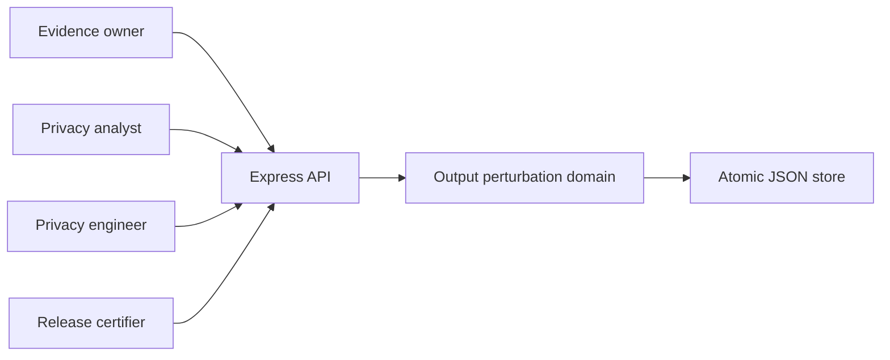
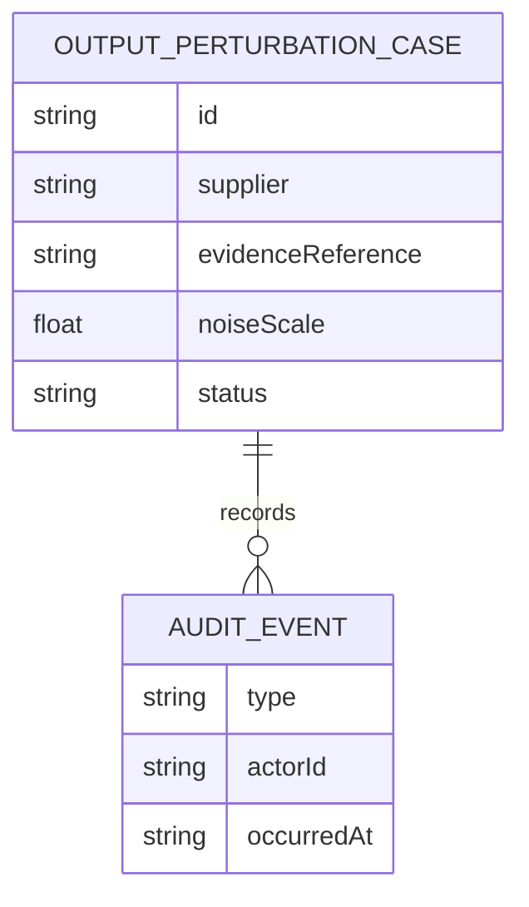
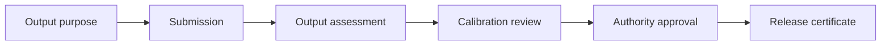
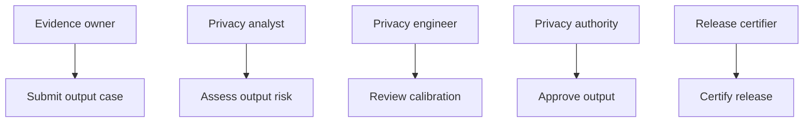
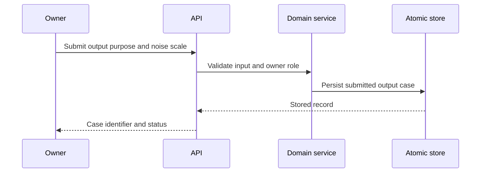

# Supplier Evidence Access Output Perturbation Control Platform

## The Problem

Supplier score and performance outputs can disclose sensitive patterns unless their perturbation design is assessed and calibrated before release. Without a controlled record of calibration, release decisions cannot demonstrate that protection was considered.

## The Solution

This service governs evidence output release through an output assessment, perturbation calibration review, authority approval, and release certification. It validates the proposed noise scale, enforces role-segregated transitions, and stores the audit record atomically.

## Live Demo and Tech Stack

Run the health endpoint at `http://localhost:65522/health`. The service uses Node.js 22, Express 5, atomic JSON persistence, Vitest, and GitHub Actions.

## Local Setup and Run Instructions

```bash
npm install
npm test
npm start
```

Lifecycle requests use `x-actor-id` and `x-actor-role` headers. The server binds to `0.0.0.0` for controlled LAN access.

## System Documentation

### System Architecture Diagram


### Entity-Relationship Diagram


### Data Flow Diagram


### Use Case Diagram


### Sequence Diagram


## Owner

Created and maintained by Kholipha Ahmmad Al-Amin.

Software Engineer and AI Specialist

Founder and CEO of EquiSaaS BD

Principal Consultant at AR IT Consultancy

Full Stack Developer and SaaS Product Builder

### Official links

Portfolio: https://kholipha-ahmmad-al-amin.equisaas-bd.com/

GitHub: https://github.com/kholipha-ahmmad-al-amin

LinkedIn: https://www.linkedin.com/in/kholipha-ahmmad-al-amin

X: https://x.com/al_amin5519

Facebook: https://www.facebook.com/kholipha.ahmmad.al.amin

Instagram: https://www.instagram.com/kholipha.ahmmad.al.amin

## Ownership

This project was created and is maintained by Kholipha Ahmmad Al-Amin.
